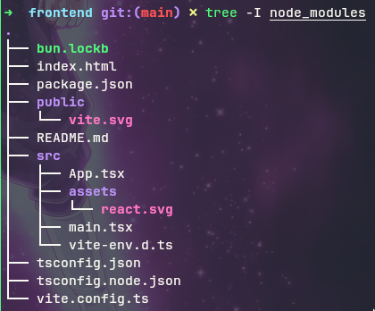

# FE-1-Setup

Initial setup using vite scaffolding with template react typescript and use bun for the package manager
```bash
bunx create-vite todo-app --template react-ts
```
this image is react file ree after remove some unnecessary file



I also update my tsconfig file with reference from [totaltypescript](https://www.totaltypescript.com/tsconfig-cheat-sheet) and [reacttemplate](https://github.com/CreativeTechGuy/ReactTemplate/blob/main/tsconfig.json)
```json
{
  "compilerOptions": {
    /* Base Options: */
    "esModuleInterop": true,
    "skipLibCheck": true,
    "target": "es2022",
    "allowJs": true,
    "resolveJsonModule": true,
    "moduleDetection": "force",
    "isolatedModules": true,
    "verbatimModuleSyntax": true,
    "lib": [
      "es2022",
      "dom",
      "dom.iterable"
    ],
    /* Strictness */
    "strict": true,
    "noUncheckedIndexedAccess": true,
    /* Bundler mode */
    "moduleResolution": "bundler",
    "jsx": "preserve",
    "noEmit": true
  },
  "include": [
    "src"
  ],
  "references": [
    {
      "path": "./tsconfig.node.json"
    }
  ]
}
```
