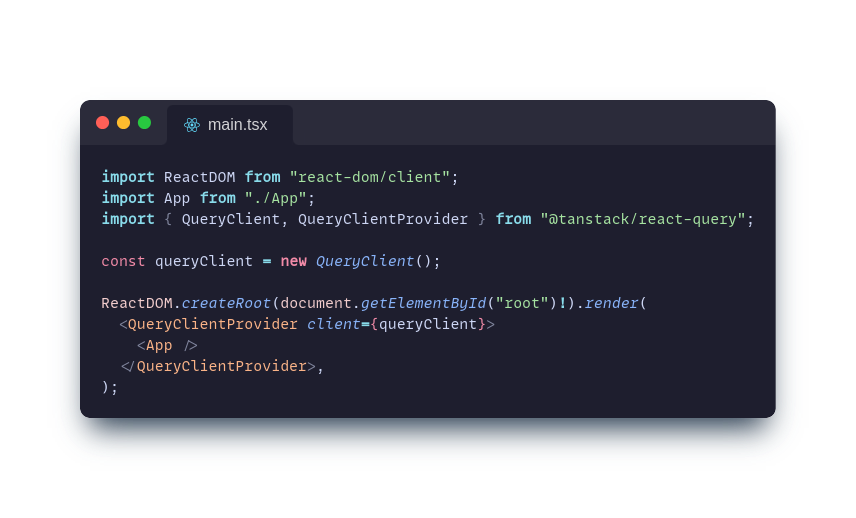

# TanStack Query aka React Query

before i know react query i use effect to do data fetching. but after sometime my friend told me it's not best practice to use effect for data fetching because use effect can give some bug e.g race condition
two different requests "raced" againts each other and came in different order than you expected. I also given theresource about that from [react documentation](https://react.dev/learn/you-might-not-need-an-effect#fetching-data).

And my friend recommended me to use this library called TanStack Query aka React Query. I try to use it in this todo app project.

